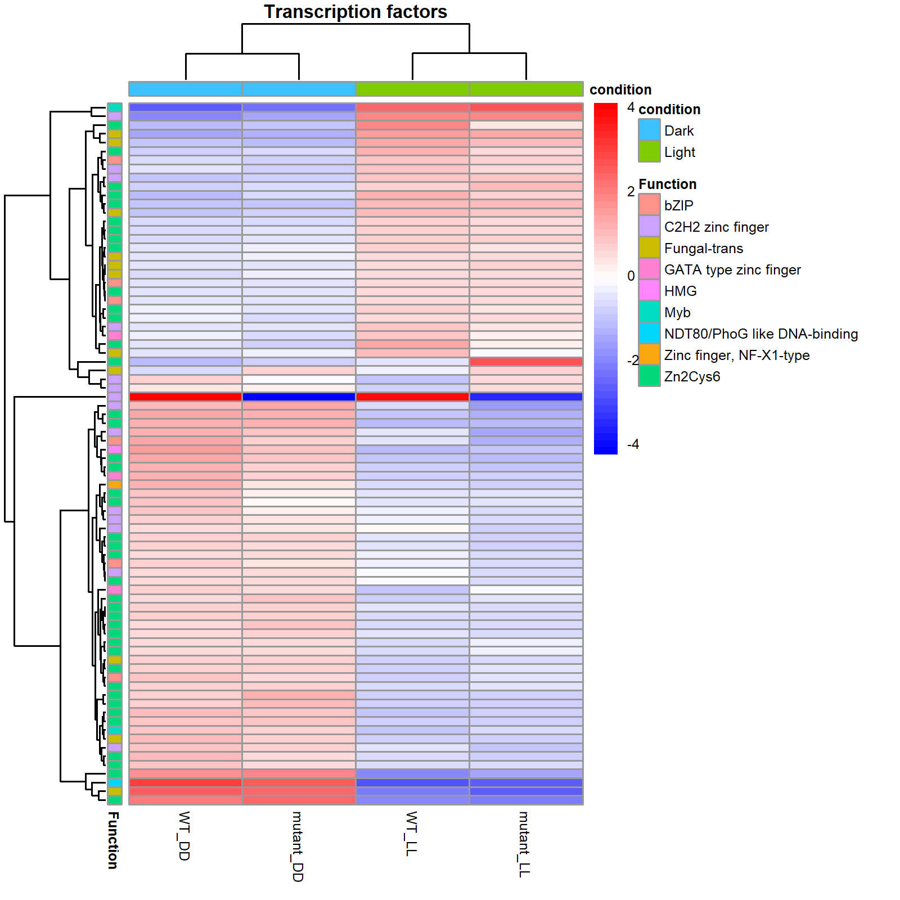

# RNASeq_analysis
 
## Description
This repository offers an R script for gene expression analysis, tailored for the organism *Trichoderma reesei* and based on the Bioconductor DESeq2 package. For details of the DESeq2 package please refere to the [DESeq2 Vignette]: https://www.bioconductor.org/packages/devel/bioc/vignettes/DESeq2/inst/doc/DESeq2.html.

The **RNASeq_analysis** script was created to analyze the findings in Schalamun et al. 2023 "The transcription factor STE12 in *T. reesei* is invovled in carbon and secondary metabolism".

The input data is a raw count matrix from *featureCounts* but other raw count matrixes from can be used as well. 
The  scripts include functions for differential gene expression analysis, normalization, principal component analysis (PCA), heatmaps generation, and gene ontology (GO) enrichment analysis. 

*Trichoderma reesei* gene annotation is based on PMCID: PMC4771370 and PMC4812632. 

The script was wrritten and executed on Windows 10 and R version 4.2.2. 
 

## Requirements and Installation

Download and install R from [CRAN](https://cran.r-project.org/).

Once R is installed, you can run the following commands in your R console to install the required packages:

```R
install.packages("BiocManager")
BiocManager::install(c("DESeq2", "apeglm", "genefilter"))
install.packages(c("readxl", "ggplot2", "dplyr", "ggrepel", "pheatmap", "RColorBrewer", "gplots", "tidyverse", "edgeR", "matrixStats", "xlsx", "dendextend", "topGO", "rrvgo"))
```

## Quick start 

1. **Obtain the Script**:
   - Clone this repository to your local machine using the command:
     ```
     git clone https://github.com/yourusername/yourrepository.git
     ```
     Or
   - Download the script file directly from the GitHub repository.

2. **Prepare the Environment**:
   - Launch RStudio
   - Install any required R packages that are not already installed.

3. **Run the Script**:
   - Open the `RNASeq_analysis.Rmd` file in RStudio.
   - Run the script interactively by executing code chunks one by one, following the explanations provided within the script. This can be done by clicking the "Run" button within each chunk in RStudio.

4. **Prepare Input Files**:
   - Sample input files specific to *Trichoderma reesei* are provided with this repository. They serve as templates for the format and structure data files should have.

## Usage
**Getting started** 
Load the libraries used
```{r libraries}
library("DESeq2")
library(stringr)
library(readxl)
library(ggplot2)
library(dplyr)
library(ggrepel)
library(apeglm)
library("pheatmap")
library("RColorBrewer")
library("genefilter")
library(gplots)
library(tidyverse) 
library(edgeR) 
library(matrixStats)
library("matchmaker")
library("xlsx")
library(dendextend)
library(topGO)
library(rrvgo)
```
 Set up working directory and date, which is added to the output files
```{r set up working directory and date}
# Set the path to the directory where you want to perform the analysis and have all other required files stored (e.g. count files). Make sure to save the script in the same directory

setwd("/path/to/script")

today <- Sys.Date()
today <- format(today, format = "%y%m%d", trim_ws = T)

#load annotation file - Modified from "The Genomes of Three Uneven Siblings: Footprints of the Lifestyles of Three Trichoderma Species"  Schmoll et al. 2016 
annotation <- read_excel("path/to/Annotation_file.xlsx")

```
Creates directories for output files
```{r }
# Creates the directories that are needed later on - execute

directory <- function(name){
  if (file.exists(name)) {
    cat("the folder already exists")
  }    else {
    dir.create(name)
  }
}

directory("contrasts")
directory("contrasts/all")
directory("contrasts/significant")
directory("contrasts/strong_filtering")
directory("plots")
directory("plots/PCA")
directory("plots/clust")
directory("plots/MA")
directory("plots/heatmaps")
directory("annotation")
directory("normalized")

```

I have included some example output files to demonstrate what you can expect from running the RNASeq_analysis script. These examples are based on the *Trichoderma reesei* data and are a good reference for understanding the kind of results the script will produce.

**Count normalization** 
In order to be able to compare counts and visualize them, they need to be normalized first. DESeq2 has its own normalization algorithms, variance stabilizing transformations (VST)  and regularized logarithm (rlog). In this example I use VST normalization. 
Additionally there are other noramlization methods such as counts per million (CPM) and fragments per kilobase (FPKM) that additionally normalizes for fragment lengths. 

 **PCA plot**
A principal component analysis (PCA) plot shows the variation between samples based on their gene expression. Similar samples will cluster together in the plot. The plot has a standard X-Y axis layout, with the axes representing the two principal components that capture the most variation in the data.
   
   Here we see that the main variation of the dataset derives from the different ligth conditions (DD, LL) used (87% variation on x-axis (PC1)). Therefore I split the dataset for the differential gene expression analysis (contrasts) in LL and DD so that the condition does not interfere too much with the effect of mutant vs WT. Here an example PCA for a separated dataset (LL only) and we see that now actually the mutant vs WT are the main variation of the dataset 

   The separation of dataset based on the condition is covered in the section "Subset by condition". 

**Heatmaps**
Heatmaps are created using pheatmap and can be used to visualize clustering of samples and genes 
 
Additionally we can focus on certain gene sets as defined in the Anntoation file (T. reesei specific) e.g. only CAZymes or transcription factors. 


**Differentially expressed genes** 
DEGs are created using the contrast function which results in two types of file, one in the directory conrasts/all which contains the values for all genes and in the directory contrasts/significant the files are already filtered for p-value and fold change. These values can be changed in the function, normally I used padj < 0.05 and log2 fold change of > |1| (corresonds to a fold change > 2) 

**Annotation**
Gene annotation is performed using the annotation file, this is specific to T. reesei but any other file in the same format can be used. 


  


