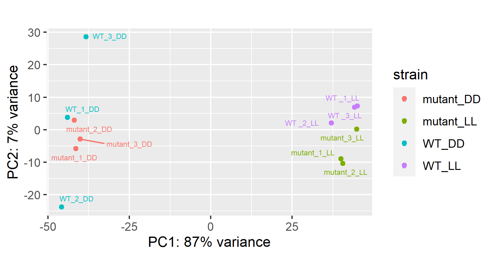
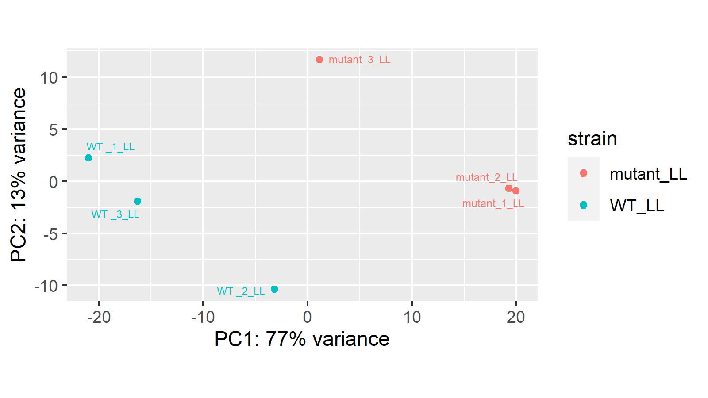
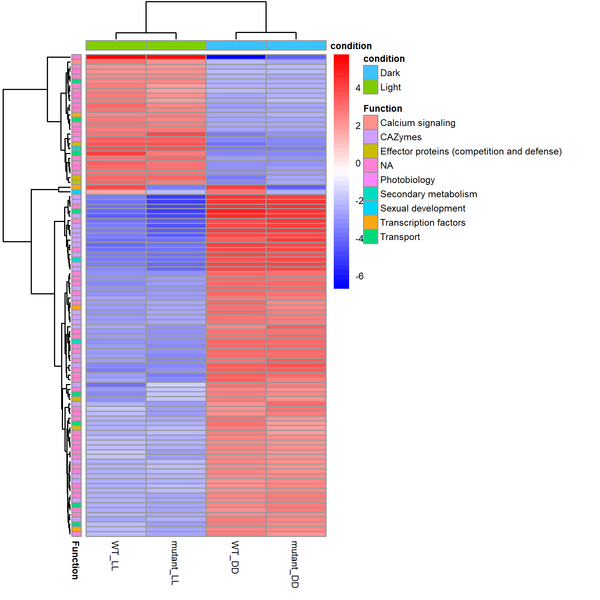
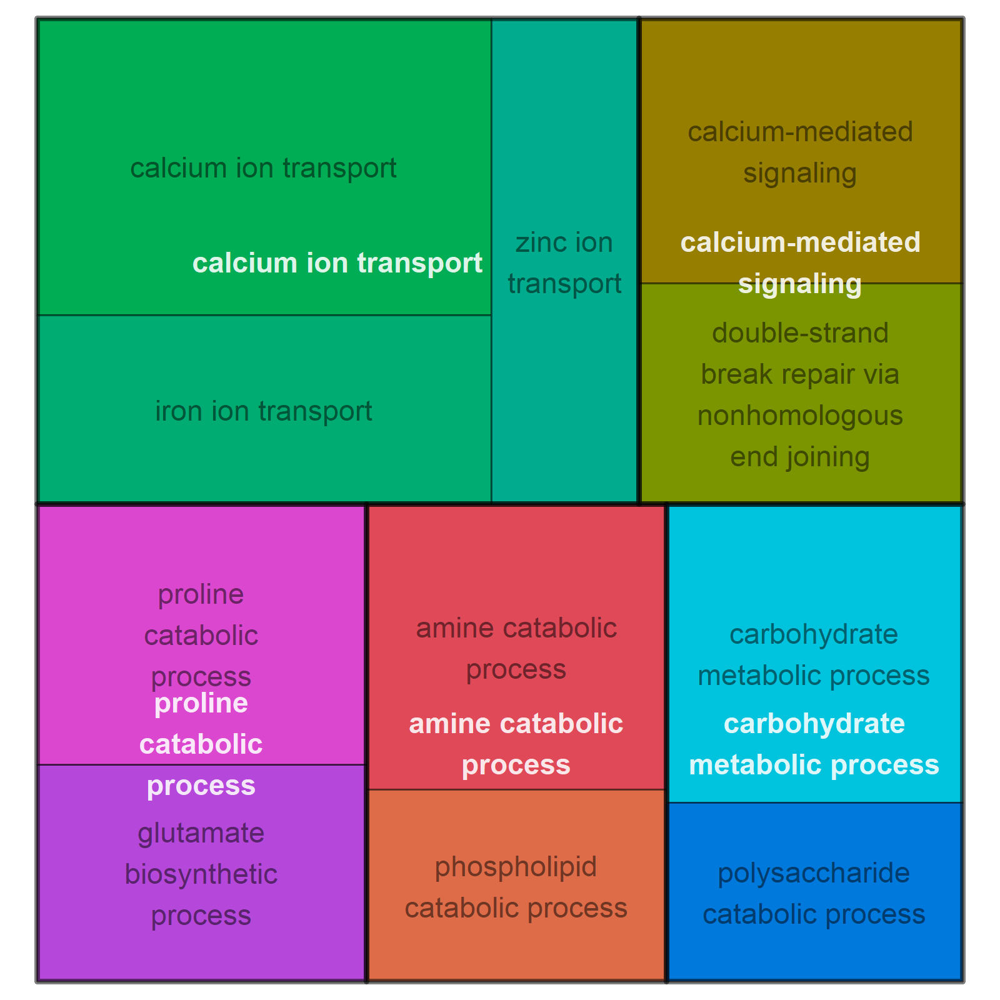

# Differential gene expression analysis optimized for _Trichoderma reesei_ RNA sequencing data 
Miriam Schalamun
30. November 2023

## Table of Contents
- [Introduction](#introduction)
- [Requirements and Installation](#requirements-and-installation)
- [Set-up](#set-up)
- [Input files](#input-files)
- [Compute DESeq object](#compute-DESeq-object)
- [Subset by condition](#subset-by-condition)
- [VST count normalization](#vst-count-normalization)
- [FPKM count normalization](#fpkm-count-normlization)
- [PCA plot](#pca-plot)
- [Heatmap plot](#heatmap-plot)
- [Heatmap filtered for topic](#heatmap-filtered-for-topic)
- [Differentially expressed genes](#differentially-expressed-genes)
- [Annotation](#annotation)
- [GO enrichment set up](#go-enrichment-set-up)
- [GO enrichment](#go-enrichment)
- [GO visualization](#go-visualization)


## Introduction
This repository offers an R script for gene expression analysis, tailored for the organism *Trichoderma reesei* and based on the Bioconductor DESeq2 package. For details of the DESeq2 package please refere to the [DESeq2 Vignette] : https://www.bioconductor.org/packages/devel/bioc/vignettes/DESeq2/inst/doc/DESeq2.html.

The **RNASeq_analysis** script was created to analyze the findings in Schalamun et al. 2023 "The transcription factor STE12 in *T. reesei* is invovled in carbon and secondary metabolism". DOI to come when published

The input data is a raw count matrix from *featureCounts* but other raw count matrixes from can be used as well. 
The  scripts include functions for differential gene expression analysis, normalization, principal component analysis (PCA), heatmaps generation, and gene ontology (GO) enrichment analysis. 

*Trichoderma reesei* gene annotation is based on PMCID: PMC4771370 and PMC4812632. 

The script was wrritten and executed on Windows 10 and R version 4.2.2. 

## Requirements and Installation

Download and install R from [CRAN](https://cran.r-project.org/).

Once R is installed, you can run the following commands in your R console to install the required packages:

```R
install.packages("BiocManager")
BiocManager::install(c("DESeq2", "apeglm", "genefilter"))
install.packages(c("readxl", "ggplot2", "dplyr", "ggrepel", "pheatmap", "RColorBrewer", "gplots", "tidyverse", "edgeR", "matrixStats", "xlsx", "dendextend", "topGO", "rrvgo"))
```

## Set-up 
 - Open the `RNASeq_analysis.Rmd` file in RStudio.
Load the libraries 
```{r libraries}
library("DESeq2")
library(stringr)
library(readxl)
library(ggplot2)
library(dplyr)
library(ggrepel)
library(apeglm)
library("pheatmap")
library("RColorBrewer")
library("genefilter")
library(gplots)
library(tidyverse) 
library(edgeR) 
library(matrixStats)
library("matchmaker")
library("xlsx")
library(dendextend)
library(topGO)
library(rrvgo)
```

**Set up working directory, date and create required directories**

Set the path to the directory where you want to perform the analysis and have all other required files stored (e.g. count files). Make sure to save the script in the same directory.

```{r}
setwd("/path/to/script")

# Set the date, which is added to the output files
today <- Sys.Date()
today <- format(today, format = "%y%m%d", trim_ws = T)

# Creates the directories that are needed

directory <- function(name){
  if (file.exists(name)) {
    cat("the folder already exists")
  }    else {
    dir.create(name)
  }
}

directory("contrasts")
directory("contrasts/all")
directory("contrasts/significant")
directory("contrasts/strong_filtering")
directory("plots")
directory("plots/PCA")
directory("plots/clust")
directory("plots/MA")
directory("plots/heatmaps")
directory("annotation")
directory("normalized")
```

## Input files
Sample input files specific to *Trichoderma reesei* are provided in this repository. They serve as templates for the format and structure data files should have.

```{r}
# Here change the file names to your files and the ds_name to the dataset you are working with
ds_name <- "example_data"

# Read count table from featurecounts 
cts <- read.table("featurecounts_example.txt", header=TRUE, row.names = 1, check.names = F)

# Rename every but the first (length) column by extracting only the NGS IDS (in the example featurecounts.txt file you can see how it looks origially and change to your needs, if you like your input names from featurecounts you don't need to select). The first column is excluded because it is the gene length column and we need it for the computatiotion of FPKM values later on.

colnames(cts)[-1] <- str_extract(colnames(cts)[-1], '[0-9]+')

# Add meta file 
meta <- read_excel("meta_example.xlsx", col_names = TRUE)

# Load annotation file - Modified from "The Genomes of Three Uneven Siblings: Footprints of the Lifestyles of Three Trichoderma Species"  Schmoll et al. 2016 
annotation <- read_excel("path/to/Annotation_file.xlsx").
```

## Compute DESeq object

The DESeq object (dds) is the DESeq2 object needed for normalization and contrasts.

```R
meta$strain <- factor(meta$strain)
meta$lightregime <-factor(meta$lightregime)
sample_names <- meta$replicate
meta$replicate <- factor(meta$replicate)
rownames(meta) <- meta$replicate

# check if row names of meta table fit to colnames of countable MUST BE "TRUE" if not there is a mistake eg sample missing and order must correspond! 

all(meta$NGS_ID %in% colnames(cts)[-1])
all(colnames(cts)[-1] == meta$NGS_ID)

# ONLY PERFORM sample renaming (from NGSS_ID to sample name) if the above is TRUE - if not than samples are switched!

if (all(colnames(cts)[-1] == meta$NGS_ID)){
  colnames(cts)[-1] <- c(sample_names) 
} else {
  print("sample names don't correspond to NGS IDs")
}

write.csv2(cts, paste0("renamed_counts_", ds_name, "_", today, ".csv"))    

# Here the DESeq object is computed, which allows for contrasts and comparison of samples for more detail refer to the DESeq2 Vignette

dds <- DESeq2::DESeqDataSetFromMatrix(countData = cts[-1],
                                      colData = meta,
                                      design = ~ strain)
mcols(dds)$basepairs <- cts$Length

dds <- DESeq(dds, minReplicatesForReplace=Inf)

````

## VST count normalization

In order to  compare counts and visualize them, they need to be normalized first. DESeq2 has its own normalization algorithms, variance stabilizing transformations (VST)  and regularized logarithm (rlog). In this example I use VST normalization. 

```{r}
# Function to perform VST (Variance Stabilizing Transformation) and calculate averages
process_condition <- function(dds, condition_name, ds_name, today) {
  # Perform variance stabilizing transformation
  vsd <- vst(dds, blind = FALSE)
  
  # Assign column names from the replicate information
  colnames(vsd) <- paste(vsd$replicate)
  
  # Define file name
  file_name <- paste0("normalized/vsd_normalized_", condition_name, "_", ds_name, "_", today, ".csv")
  
  # Check if file exists to avoid overwriting
  if(!file.exists(file_name)) {
    write.csv2(assay(vsd), file_name)
  } else {
    message("File '", file_name, "' already exists. Skipping write.")
  }
  
  # Calculate the average VST-normalized counts for each strain
  unique_strains <- unique(vsd$strain)
  avvsd <- as.data.frame(matrix(0, nrow(assay(vsd)), length(unique_strains)))
  rownames(avvsd) <- rownames(assay(vsd))
  colnames(avvsd) <- unique_strains
  
  for(strain in unique_strains) {
    avvsd[[strain]] <- rowMeans(assay(vsd)[, vsd$strain == strain])
  }
  
  # Return a list containing both avvsd and vsd
  return(list(avvsd = avvsd, vsd = vsd))
}

# Process each condition and store the results in lists
results <- process_condition(dds, "", ds_name, today)

# Extracting the VST objects
vsd <- results$vsd

# Extracting the average VST-normalized counts
avvsd <- results$avvsd

```

## FPKM count normalization

Fragments Per Kilobase of transcript per Million mapped reads (FPKM) and can also be used for visualizations like PCA and heatmaps.

```{r}
fpkm <- fpkm(dds, robust = T)
head(fpkm)
colnames(fpkm) <- paste(vsd$replicate)
write.csv2(fpkm, paste0("normalized/fpkm", "_",ds_name, "_", today, "_", ".csv"))

```

 ## PCA plot
A principal component analysis (PCA) plot shows the variation between samples based on their gene expression. Similar samples will cluster together in the plot. The plot has a standard X-Y axis layout, with the axes representing the two principal components that capture the most variation in the data. This is also a useful visualisation to check for outliers. 

 ```{r}
# Execute the function that automatically creates PCA plots, here you can change e.g. the size of the plot. 
# Look at the plots (in publication ready resolution) in the plots/PCA directory
PCA_plot <- function(data, name, postfix){
  png(filename = paste0("plots/PCA/", name,"_PCA_", postfix, "_", today, ".png"), width = 1600, height = 900, res = 300)
  pcaData <- plotPCA(data, intgroup="strain", returnData=TRUE) 
  percentVar <- round(100 * attr(pcaData, "percentVar"))
  print(ggplot(pcaData, aes(PC1, PC2, color=strain, label=rownames(pcaData))) + 
          geom_point() +
          geom_text_repel(size=2) +
          xlab(paste0("PC1: ",percentVar[1],"% variance")) +
          ylab(paste0("PC2: ",percentVar[2],"% variance")) + 
          coord_fixed())
  dev.off()
}

# This executes the PCA plot function
PCA_plot(data = vsd, name = ds_name, postfix = "")
```

   
Here we see that the main variation of the dataset derives from the different ligth conditions (DD, LL) used (87% variation on x-axis (PC1)). Therefore I have to split the dataset (DESeq object) for the differential gene expression analysis (contrasts) in LL and DD so that the condition does not interfere too much with the effect of mutant vs WT. 


## Subset by condition

The data set I mostly used consists of different mutants under two conditions. As seen above in the PCA, most of the time the condition (light) is the strongest factor of variance therefore I need to split my data set when computing the dds element for the contrasts later on. A good indicator for that is the PCA plot, it is recommended that if PCA1 (X-axis) has a higher value than 60% and this is likely to arise from a condition and not the strains you want to analyse then it is advisable to split the data set like done here. 

```R
generate_DESeq_object <- function (condition) {
  # Use grep to find columns that contain the condition (e.g., "DD" or "LL")
  matching_columns <- grep(condition, colnames(cts), value = TRUE)
  data_subset <- cts[, matching_columns]
  
  subset_meta <- meta %>% 
    filter(lightregime == condition)
  subset_meta$strain <- factor(subset_meta$strain)
  
  # 'Strain' is used to subset 'meta' by matching strains
  
  my_colData <- subset_meta
  
  # Print the colData to check it
  print(my_colData)
  
  # Create the DESeqDataSet
  dds <- DESeqDataSetFromMatrix(countData = data_subset,
                                colData = subset_meta,
                                design = ~ strain)
  
  # Run DESeq analysis
  dds <- DESeq(dds, minReplicatesForReplace=Inf)
  
  return(dds)
}

# Generates the dds object only for condition specific samples in order to avoid influences from condition (DD or LL)
dds_DD <- generate_DESeq_object("DD")
dds_LL <- generate_DESeq_object("LL")

````

# PCA plot for separated conditions 

In order to visually check if splitting the data set by condition worked we run the VST normalization and PCA plot for the split dataset.

```R
# Process each condition and store the results in lists
results_DD <- process_condition(dds_DD, "DD", ds_name, today)
results_LL <- process_condition(dds_LL, "LL", ds_name, today)


# Extracting the VST objects
vsd_DD <- results_DD$vsd
vsd_LL <- results_LL$vsd

# Extracting the average VST-normalized counts data frames
avvsd_DD <- results_DD$avvsd
avvsd_LL <- results_LL$avvsd

PCA_plot(data = vsd_DD, name = ds_name, postfix = "DD")
PCA_plot(data = vsd_LL, name = ds_name, postfix = "LL")

```

PCA for a separated dataset (LL only) and we see that now actually the mutant vs WT are the main variation of the dataset



## Heatmap plot

Heatmaps are created using pheatmap and can be used to visualize clustering of samples and genes.

```{r}
#First execute the function
heatmap_plot <- function(data, name, postfix, rownumbers){
  avvsd_topic <- tibble::rownames_to_column(data, "gene")
  anno_topic <- annotation[,c("Geneid", "MMBR gene name", "TOPIC", "MMBR group", "Anno Trichoderma topic")]
  topic <- right_join(anno_topic, avvsd_topic, by = c("Geneid" = "gene"))
  topic <- as.data.frame(topic)
  topic <- column_to_rownames(topic, var = "Geneid")
  
  row_anno <- as.data.frame(topic$`TOPIC`)
  rownames(row_anno) <- paste(row.names(topic))
  colnames(row_anno)<- c("Function")
  
  col_anno <- data.frame(condition = ifelse(grepl("LL",colnames(topic)), "Light", "Dark"))
  row.names(col_anno) <- colnames(topic)
  
  #standard heatmap 

  topVar <- head(order(-rowVars(data)), n=rownumbers)
  mat <- data[topVar, ]
  mat <- mat - rowMeans(mat)
  png(filename = paste0("plots/heatmaps/", name, "_heatmap_", rownumbers, "_", postfix, "_", today, ".png"), width = 1600, height = 1600, res = 300)
  pheatmap(mat, color=colorRampPalette(c("blue", "white", "red"))(50), show_rownames = F, cutree_cols = 1, cutree_rows = 1, fontsize_row = 4, fontsize = 6, treeheight_row = 40, treeheight_col = 20, annotation_row = row_anno, annotation_col = col_anno)
  dev.off()
}

# Enter the number of how many genes should be displayed
rownumbers <- 100

# Automatically saves the figures in the plots/heatmaps directory
heatmap_plot(data = avvsd, name = ds_name, rownumbers = 100, postfix = "")
heatmap_plot(data = avvsd_DD, name = ds_name, rownumbers = 100, postfix = "DD")
heatmap_plot(data = avvsd_LL, name = ds_name, rownumbers = 100, postfix = "LL")

```
 

**Heatmap filtered for topic**

This is  specific to the T. reesei Annotation file and refers to the different assigned "topics".
Example topics: Secondary metabolism, CAZymes, Transcription factors, Transporters..the spelling has to be exactly like in the annotation working file
The rownumbers might be lower than for above because some topics only have a few genes in them (eg there are ~400 CAZymes in total of which only a few might show different expression levels, so it likely is more interesting to only look at a subset of the most regulated ones, eg. 50 )

```{r }
#First execute the function
heatmap_plot_TOPIC <- function(data, name, postfix, rownumbers, whichTOPIC){
  
avvsd_topic <- tibble::rownames_to_column(data, "gene")
  anno_topic <- annotation[,c("Geneid", "MMBR gene name", "TOPIC", "MMBR group", "Anno Trichoderma topic")]
  topic <- right_join(anno_topic, avvsd_topic, by = c("Geneid" = "gene"))
  topic <- as.data.frame(topic)
  topic <- column_to_rownames(topic, var = "Geneid")
  
  col_anno <- data.frame(condition = ifelse(grepl("LL",colnames(topic)), "Light", "Dark"))
  row.names(col_anno) <- colnames(topic)

  whichTOPIC <- whichTOPIC
topic_filtered <- filter(topic, TOPIC == whichTOPIC)
print(whichTOPIC)

# takes the column MMBR group for row annotation (= the groups for eg function)
# first create a "clean names" table

row_anno <- as.data.frame(topic_filtered$`MMBR group`)
rownames(row_anno) <- paste(row.names(topic_filtered))
colnames(row_anno)<- c("Function")

# column annotations (DD or LL mostly)
col_anno <- data.frame(condition = ifelse(grepl("LL",colnames(topic_filtered)), "Light", "Dark"))
row.names(col_anno) <- colnames(topic_filtered)

# subset columns = samples (eg if more datasets combined or you only want DD or LL and to only have the normalized counts (it doesnt work if there are the descriptions in there ,therefore you always have to call for all the samples you want in the heatmap))

topic_heatmap <- as.data.frame(topic_filtered[, !(colnames(topic_filtered) %in% c("MMBR gene name", "TOPIC", "MMBR group", "Anno Trichoderma topic"))])

 topVar <- head(order(-rowVars(topic_heatmap)), n=rownumbers)
  mat <- topic_heatmap[topVar, ]
  mat <- mat - rowMeans(mat)
  
  png(filename = paste0("plots/heatmaps/", name, "_heatmap_", rownumbers, "_", postfix, "_", whichTOPIC, "_", today, ".png"), width = 1600, height = 1600, res = 300)
  pheatmap(mat, color=colorRampPalette(c("blue", "white", "red"))(50), show_rownames = F, cutree_cols = 1, cutree_rows = 1, fontsize_row = 4, fontsize = 6, treeheight_row = 40, treeheight_col = 20, annotation_row = row_anno, annotation_col = col_anno, main = whichTOPIC)
  dev.off()
}

# Filter by "TOPIC" and the type you want to filter for (eg Secondary metabolism or CAZymes, must be written exactly as in the annotation file), the rownumbers are the number of genes displayed. 
rownumbers <- 300
whichTOPIC <- "CAZymes"

#Automatically saves the figures in the plots/heatmaps directory
heatmap_plot_TOPIC(data = avvsd, name = ds_name, rownumbers, postfix = "", whichTOPIC)
heatmap_plot_TOPIC(data = avvsd_DD, name = ds_name, rownumbers, postfix = "DD", whichTOPIC)
heatmap_plot_TOPIC(data = avvsd_LL, name = ds_name, rownumbers, postfix = "LL", whichTOPIC)

```


## Differentially expressed genes
DEGs are created using the contrast function which results in two types of file, one in the directory conrasts/all which contains the values for all genes and in the directory contrasts/significant the files are already filtered for p-value and fold change. These values can be changed in the function, normally I used padj < 0.05 and log2 fold change of > |1| (corresonds to a fold change > 2) 

```{r Contrasts}
# First execute the function
contrasts_function <- function(dds, mutant_base, WT_base, condition1, condition2, padj_cutoff, log2_cutoff, today){
  # Generate file names
  contrast_name <- paste0(mutant_base, "_", condition1, "__", WT_base, "_", condition2)
  name <- paste0("contrasts/all/", contrast_name, "_all_", today, ".csv")
  name_sig <- paste0("contrasts/significant/", contrast_name, "_sig_", today, ".csv")
  
  # Check if the results file already exists to avoid overwriting
  if (!file.exists(name)) {
    # Create contrast vectors
    mutant <- paste0(mutant_base, "_", condition1)
    WT <- paste0(WT_base, "_", condition2)
  
    # Run the DESeq2 results function
    res <- results(dds, contrast = c("strain", mutant, WT), cooksCutoff = FALSE, independentFiltering = FALSE)
    data_padj <- subset(res, padj < padj_cutoff)
    data_LFC1 <- subset(data_padj, log2FoldChange < -log2_cutoff | log2FoldChange > log2_cutoff)
    data_significant <- data_LFC1[order(data_LFC1$log2FoldChange),]
  
    # Write results to CSV
    write.csv2(res, name)
    write.csv2(data_significant, name_sig)
  } else {
    message("File ", name, " already exists. Skipping.")
  }
}

#  the names have to be exactly as in the meta file
mutant <- "mutant"
WT <- "WT"

# Run contrasts function for DD
contrasts_function(dds_DD, mutant, WT, "DD", "DD", 0.05, 1, today)

# Run contrasts function for LL
contrasts_function(dds_LL, mutant, WT, "LL", "LL", 0.05, 1, today)


# Run contrasts function for contrasts between conditions (e.g. DD vs LL)
# Out of simplicity names mutant and WT say the same here but they just refer to the one condition you want to look at as a "background" which corresponds to the WT and the condition which changed which corresponds to mutant here. Make sure that always the correct values for "WT" and "mutant" are logged in. 

mutant <- "mutant"
WT <- "WT"

contrasts_function(dds, mutant, WT, "LL", "DD", 0.05, 1, today)

```

## Annotation
Gene annotation is performed using the annotation file, this is specific to T. reesei but any other file in the same format can be used. 

```R
 annotation_function <- function(data, name){
  as.data.frame(annotation)
  as.data.frame(annotation)
  as.data.frame(data)
  
  colnames(data) <- c("gene", "basemean", "log2FoldChange", "lfcSE", "pvalue", "padj")
  data <- data[,c("gene", "log2FoldChange")]
  
  foldchange <- gtools::logratio2foldchange(data$log2FoldChange)
  as.matrix(foldchange)
  contrast_fold <- data.frame(data, foldchange)
  
  upregulated <- subset(contrast_fold, log2FoldChange > 1)
  up_anno <- right_join(annotation, upregulated, by = c("Geneid" = "gene"))
  up_anno <- up_anno %>% relocate(log2FoldChange, foldchange, .after = `position in chromosome`)
  up_anno <- up_anno[order(up_anno$log2FoldChange, decreasing = T),]
  up_anno <- as.data.frame(up_anno)
  
  downregulated <- subset(contrast_fold, log2FoldChange < -1)
  down_anno <- right_join(annotation, downregulated, by = c("Geneid" = "gene"))
  down_anno <- down_anno %>% relocate(log2FoldChange, foldchange, .after = `position in chromosome`)
  down_anno <- down_anno[order(down_anno$log2FoldChange),]
  down_anno <- as.data.frame(down_anno)
  
  write.xlsx(up_anno, file = paste0(name), sheetName = paste0("up"), row.names = F, append = T)
  write.xlsx(down_anno, file = paste0(name), sheetName = paste0("down"), row.names = F, append = T)
  
}

contrast_files <- dir(path = "contrasts/significant/", pattern = ".csv", full.names = T, recursive = F)
for(i in contrast_files){
  data <- read.csv2(i)
  anno_name <- tools::file_path_sans_ext(base::basename(i))
  name <- paste0("annotation/", anno_name, "_anno", ".xlsx")
  
  if (file.exists(name)) {
      cat("the file already exists")
  }else
    annotation_function(data = data, name = name)
}
```

## GO enrichment set up
Creates the directories and functions for GO enrichment and visualization, here you don't need to change anything. Just execute.

```R
directory <- function(name){
  if (file.exists(name)) {
    cat("the folder already exists")
  }    else {
    dir.create(name)
  }
}
directory("GO")
directory("GO/rrvgo")
directory("GO/plots")
directory("GO/plots/treemap")
directory("GO/plots/treemap/BP")
directory("GO/plots/treemap/BP/weighted")
directory("GO/plots/treemap/BP/classic")
directory("GO/plots/treemap/MF")
directory("GO/plots/treemap/MF/weighted")
directory("GO/plots/treemap/MF/classic")

Gofunction <- function(data, name, rrvgo, ontology){
  
  as.data.frame(data)
  data <- as.character(data[,c(1)])
  geneList2 <- factor(as.integer(geneUniverse %in% data))
  names(geneList2) <- geneUniverse

# build the GOdata object, use BP (biol. proc.); MF (molec. func.) or CC (cel. comp.)
  GOdata <- new("topGOdata", ontology = category, allGenes = geneList2,  annot = annFUN.gene2GO, gene2GO = geneID2GO)

# Cacluate p-value using the fisher's exact test 
  resultClassic <- runTest(GOdata, algorithm="classic", statistic ="fisher")
  
  resultweight01 <- runTest(GOdata, algorithm="weight01", statistic = "fisher")
  
  allRes <- GenTable(GOdata, classicFisher = resultClassic, weighted = resultweight01, orderBy = "classicFisher", ranksOf = "classicFisher", topNodes = length(topGO::score(resultClassic)))
  
  cutoff <- subset(allRes, classicFisher < 1)
  write.csv2(allRes, name, row.names = F)
  write.csv2(allRes[,c("GO.ID", "classicFisher", "weighted")], rrvgo, row.names = F)
}

rrvgo_function_MF_classic <- function(data, name, pvalue, threshold){
  go_analysis <- data
  go_analysis$classicFisher <- (as.numeric(go_analysis$classicFisher))
  go_analysis_p <- subset(go_analysis, classicFisher < pvalue)
  
  simMatrix <- rrvgo::calculateSimMatrix(go_analysis_p$GO.ID, ont = "MF", method = "Rel", orgdb = "org.Sc.sgd.db")
  
  scores <- setNames(-log10(go_analysis$classicFisher), go_analysis$GO.ID)
  
  reducedTerms <- reduceSimMatrix(simMatrix, scores, threshold, orgdb = "org.Sc.sgd.db")
  
  png(filename = paste0("GO/plots/treemap/MF/classic/", name, "_p", pvalue, "_", threshold, ".png"), width = 1600, height = 1600, res = 300)
rrvgo::treemapPlot(reducedTerms = reducedTerms)

dev.off()
}

rrvgo_function_MF_weighted <- function(data, name, pvalue, threshold){
  go_analysis <- data
  go_analysis$weighted <- (as.numeric(go_analysis$weighted))
  go_analysis_p <- subset(go_analysis, weighted < pvalue)
  
  simMatrix <- rrvgo::calculateSimMatrix(go_analysis_p$GO.ID, ont = "MF", method = "Rel", orgdb = "org.Sc.sgd.db")
  
  scores <- setNames(-log10(go_analysis$weighted), go_analysis$GO.ID)
  
  reducedTerms <- reduceSimMatrix(simMatrix, scores, threshold, orgdb = "org.Sc.sgd.db")
  
  png(filename = paste0("GO/plots/treemap/MF/weighted/", name, "_p", pvalue, "_", threshold, "_weighted", ".png"), width = 1600, height = 1600, res = 300)
rrvgo::treemapPlot(reducedTerms = reducedTerms)

dev.off()
}

rrvgo_function_BP_classic <- function(data, name, pvalue, threshold){
  go_analysis <- data
  go_analysis$classicFisher <- (as.numeric(go_analysis$classicFisher))
  go_analysis_p <- subset(go_analysis, classicFisher < pvalue)
 
  
  simMatrix <- rrvgo::calculateSimMatrix(go_analysis_p$GO.ID, ont = "BP", method = "Rel", orgdb = "org.Sc.sgd.db")
  
  scores <- setNames(-log10(go_analysis$classicFisher), go_analysis$GO.ID)
  
  reducedTerms <- reduceSimMatrix(simMatrix, scores, threshold, orgdb = "org.Sc.sgd.db")
   
  filename <- paste0("GO/plots/treemap/BP/classic/", name, "_p", pvalue, "_", threshold, ".png")
  print(filename)
  if (file.exists(filename)) {
    cat("the file already exists")
  }else
  png(filename = filename,  width = 1600, height = 1600, res = 300)
rrvgo::treemapPlot(reducedTerms = reducedTerms)

dev.off()
}

rrvgo_function_BP_weighted <- function(data, name, pvalue, threshold){
  go_analysis <- data
  go_analysis$weighted <- (as.numeric(go_analysis$weighted))
  go_analysis_p <- subset(go_analysis, weighted < pvalue)
  
  simMatrix <- rrvgo::calculateSimMatrix(go_analysis_p$GO.ID, ont = "BP", method = "Rel", orgdb = "org.Sc.sgd.db")
  
  scores <- setNames(-log10(go_analysis$weighted), go_analysis$GO.ID)
  
  reducedTerms <- reduceSimMatrix(simMatrix, scores, threshold, orgdb = "org.Sc.sgd.db")
 
  filename <- paste0("GO/plots/treemap/BP/weighted/", name, "_p", pvalue, "_", threshold, ".png")
  print(filename)
  if (file.exists(filename)) {
    cat("the file already exists")
  }else
  png(filename = filename,  width = 1600, height = 1600, res = 300)
rrvgo::treemapPlot(reducedTerms = reducedTerms)

dev.off()
}

scatterplot_function_BP_classic <- function(data, name, pvalue, threshold){
  go_analysis <- data
  go_analysis$classicFisher <- (as.numeric(go_analysis$classicFisher))
  go_analysis_p <- subset(go_analysis, classicFisher < pvalue)
  
  simMatrix <- rrvgo::calculateSimMatrix(go_analysis_p$GO.ID, ont = "BP", method = "Rel", orgdb = "org.Sc.sgd.db")
  
  scores <- setNames(-log10(go_analysis$classicFisher), go_analysis$GO.ID)
  
  reducedTerms <- reduceSimMatrix(simMatrix, scores, threshold, orgdb = "org.Sc.sgd.db")
  
  png(filename = paste0("GO/plots/scatterplot/BP/", "scatter_", name, "_p", pvalue, "_", threshold, ".png"), width = 1600, height = 1600, res = 300)
rrvgo::scatterPlot(simMatrix, reducedTerms, size = "score")

dev.off()
}
```

## GO enrichment

Performs GO enrichment using topGO. 

```R
BPterms <- ls(GOBPTerm)
MFterms <- ls(GOMFTerm)

# Load custom annotation file  
geneID2GO <- readMappings(file = "directory/GOterms.txt")

# I needed in a format that I have one gene ID and listed next to it the GO terms
GO2geneID <- inverseList(geneID2GO) 
geneID2GO <- inverseList(GO2geneID)
str(head(geneID2GO))

# set names of all genes that we have for the GOterms 
geneNames <- names(geneID2GO)
geneUniverse <- names(geneID2GO)

# automatically loads all significant contrasts and performs the Gofunction - might take a few minutes, so this means in this cas you perform the go enrichment only on the significantly differntially regulated genes

contrast_files <- dir(path = "contrasts/significant/", full.names = T, recursive = F)

## Here you can change which category you want BP (biological process) or MF (molecular function)
category <- "MF"

for(i in contrast_files){
  data <- read.csv2(i)
  GO_name <- tools::file_path_sans_ext(base::basename(i))
  ontology <- category
  name <- paste0("GO/","GO_", GO_name, "_", ontology, ".csv")
  rrvgo <- paste0("GO/rrvgo/","rrvgo_", GO_name, ontology, ".csv")
  if (file.exists(name)) {
      cat("the file already exists ")
  }else

Gofunction(data = data, name = name, rrvgo=rrvgo, ontology = category)
}


```

## GO visualization

Visualize using rrvgo and the yeast database for terms.
Run the tests to determine pvalues for each go term using different algorithms (classic fisher or weighted). 
Classic: "each GO term is tested independently not taking the GO hierachy into account. 
weight01:a mix between "weight" and "elim" - is more conservative than classic but has less false positives and might miss true positives but the significance of scores (Alexa et al 2006 - Improved scoring of functional groups..).  
However in many publications classic fisher is used. The advantage of weighted is that to me it sounds its more reliable and in the later created trees for visualization you more likely get the parent terms which make it easier to find important terms than looking at >100 terms. 

```R
# yeast db: 
library("org.Sc.sgd.db")

for(i in contrast_files){
  data <- read.csv2(i)
  GO_name <- tools::file_path_sans_ext(base::basename(i))
  ontology <- category
  name <- paste0("GO/","GO_", GO_name, "_", ontology, ".csv")
  rrvgo <- paste0("GO/rrvgo/","rrvgo_", GO_name, ontology, ".csv")
  if (file.exists(name)) {
      cat("the file already exists ")
  }else

Gofunction(data = data, name = name, rrvgo=rrvgo, ontology = category)
}

# Biological Process category (BP)

rrvgo_files_BP <- dir(path = "GO/rrvgo", pattern = ".csv", full.names = T, recursive = F)

threshold <- "0.7"
pvalue <- "0.1"

# classic algorithm
for(i in rrvgo_files_BP){
  data <- read.csv2(i)
  GO_name <- tools::file_path_sans_ext(base::basename(i))
  name <- paste0(GO_name)
  threshold <- paste0(threshold)
  pvalue <- paste0(pvalue)
rrvgo_function_BP_classic(data, name, pvalue, threshold)
}

#weighted algorithm (more stringent but might loose info)
for(i in rrvgo_files_BP){
  data <- read.csv2(i)
  GO_name <- tools::file_path_sans_ext(base::basename(i))
  name <- paste0(GO_name)
  threshold <- paste0(threshold)
  pvalue <- paste0(pvalue)

rrvgo_function_BP_weighted(data, name, pvalue, threshold)
}

# Molecular Function category (MF) 
rrvgo_files_MF <- dir(path = "GO/rrvgo/", pattern = "MF.csv", full.names = T, recursive = F)

for(i in rrvgo_files_MF){
  data <- read.csv2(i)
  GO_name <- tools::file_path_sans_ext(base::basename(i))
  name <- paste0(GO_name)
  threshold <- paste0(threshold)
  pvalue <- paste0(pvalue)

rrvgo_function_MF_weighted(data, name, pvalue, threshold)
}

```
 
